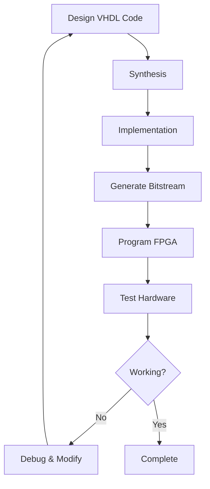

# EEE 102 - Introduction to Digital Circuit Design

[](https://github.com/furkanbsk/EEE102-Digital-Circuit-Design)
[](https://store.digilentinc.com/basys-3-artix-7-fpga-trainer-board-recommended-for-introductory-users/)
[](https://en.wikipedia.org/wiki/VHDL)
[](https://www.xilinx.com/products/design-tools/vivado.html)

> **Course Repository**: Introduction to Digital Circuit Design laboratory work and final project implementation using VHDL on Xilinx BASYS3 FPGA development board.

## 📋 Table of Contents

- [Course Overview](#-course-overview)
- [Laboratory Work](#-laboratory-work)
- [Final Project](#-final-project)
- [Hardware Requirements](#-hardware-requirements)
- [Software Setup](#-software-setup)
- [Repository Structure](#-repository-structure)
- [Getting Started](#-getting-started)
- [Documentation](#-documentation)
- [Contributing](#-contributing)
- [License](#-license)

## 🎯 Course Overview

**EEE 102** introduces fundamental concepts of digital circuit design, FPGA programming, and hardware description languages. This repository contains:

- **7 Laboratory Exercises** covering digital logic fundamentals
- **1 Final Project** implementing an automated cocktail dispensing machine
- **Reference Materials** including BASYS3 documentation and Vivado tutorials
- **Circuit Diagrams** and timing analysis examples

### Learning Objectives

- Understanding digital logic gates and Boolean algebra
- Mastering VHDL hardware description language
- Working with counters, registers, and sequential circuits
- Implementing complex digital systems on FPGA platforms
- Designing user interfaces with LCD displays and push buttons

## 🧪 Laboratory Work

### Lab 1: Digital Logic Fundamentals
- **Topics**: Basic logic gates, truth tables
- **Deliverables**: Logic gate implementations and analysis

### Lab 2: Combinational Circuits
- **Topics**: Combinational logic design
- **Deliverables**: Circuit optimization and implementation

### Lab 3: Counters and Sequential Logic
- **Topics**: 74HC163 counter, clock division
- **Key Components**:
  - Clock signal generation
  - 4-bit synchronous counter implementation
  - Output signal timing analysis
- **Circuit Diagrams**: 74HC163 timing diagrams included

### Lab 4: Advanced Sequential Circuits
- **Topics**: State machines, flip-flops
- **Deliverables**: Sequential circuit design and analysis

### Lab 5: Memory Systems
- **Topics**: RAM, ROM, memory interfacing
- **Deliverables**: Memory system implementations

### Lab 6: VHDL Programming
- **Topics**: Hardware description language fundamentals
- **Reference**: `vhdl_registers_and_counters.pdf`
- **Deliverables**: VHDL code examples and simulations

### Lab 7: FPGA Implementation
- **Topics**: FPGA programming, constraints files
- **Key Components**:
  - Button input handling (active low/high configurations)
  - LED output control circuits
  - Pull-up/pull-down resistor configurations
- **Circuit Diagrams**: Button and LED interface circuits

## 🍹 Final Project: Automated Cocktail Machine

### Project Overview
Design and implementation of an automated cocktail dispensing system using VHDL on BASYS3 FPGA.

### System Architecture

```
┌─────────────────┐    ┌──────────────┐    ┌─────────────────┐
│   User Interface│───▶│ Main Control │───▶│ Pump Controllers│
│   (LCD + BTNs)  │    │   Module     │    │   (Multiple)    │
└─────────────────┘    └──────────────┘    └─────────────────┘
         │                       │                    │
         ▼                       ▼                    ▼
┌─────────────────┐    ┌──────────────┐    ┌─────────────────┐
│ Text Display    │    │LCD Driver    │    │ Hardware I/O    │
│ Controller      │    │              │    │ (Pumps/Valves)  │
└─────────────────┘    └──────────────┘    └─────────────────┘
```

### Hardware Components

#### VHDL Modules (Implementation Planned)
- **`Main_Coctail.vhd`** - Primary system controller
- **`LCD_Driver.vhd`** - LCD display interface controller
- **`Text_Display.vhd`** - Text rendering and display management
- **`Pump_Driver.vhd`** - Pump control and timing logic
- **`Cocktail.xdc`** - FPGA pin constraints and timing specifications

#### Features
- 🖥️ **LCD Interface**: Recipe selection and status display
- 🔘 **Button Controls**: User input for cocktail selection
- ⚙️ **Pump Control**: Precise liquid dispensing control
- ⏱️ **Timing System**: Accurate ingredient mixing ratios
- 🔄 **State Machine**: Robust operation flow control

### Technical Specifications

| Component | Specification |
|-----------|---------------|
| FPGA Board | Xilinx BASYS3 (Artix-7) |
| Clock Frequency | 100 MHz (board clock) |
| Display | 16x2 Character LCD |
| Input Method | 5 Push Buttons |
| Output Control | Multiple pump drivers |
| Language | VHDL |
| Development Tool | Xilinx Vivado |

## 🛠 Hardware Requirements

### Essential Components
- **Xilinx BASYS3 FPGA Development Board**
- **16x2 Character LCD Display**
- **Push Buttons** (for user interface)
- **Pumps/Valves** (for liquid dispensing)
- **Connecting Wires** and **Breadboard**
- **Power Supply** (5V for external components)

### Optional Components
- **LEDs** for status indication
- **Resistors** (1kΩ for LED current limiting)
- **Capacitors** for power filtering

## 💻 Software Setup

### Prerequisites
1. **Xilinx Vivado Design Suite** (2018.3 or later)
2. **BASYS3 Board Support Package**
3. **USB Cable** (for FPGA programming)

### Installation Steps

1. **Download Vivado**
   ```bash
   # Download from Xilinx website (requires free account)
   # https://www.xilinx.com/products/design-tools/vivado.html
   ```

2. **Install BASYS3 Board Files**
   ```bash
   # Copy board files to Vivado installation directory
   # Location: <Vivado_Install>/data/boards/board_files/
   ```

3. **Clone Repository**
   ```bash
   git clone https://github.com/furkanbsk/EEE102-Digital-Circuit-Design.git
   cd EEE102-Digital-Circuit-Design
   ```

## 📁 Repository Structure

```
EEE102-Digital-Circuit-Design/
├── README.md                           # This documentation
├── Lab1/                               # Digital Logic Fundamentals
│   ├── Furkan Büyüksarıkulak-EE102 Lab 1 Report.pdf
│   └── lab1.pdf
├── Lab2/                               # Combinational Circuits
│   ├── Furkan_Büyüksarıkulak_EE102_Lab2_Report.pdf
│   └── lab2.pdf
├── Lab3/                               # Counters and Sequential Logic
│   ├── EE 102 LAB 3 REPORT Furkan Büyüksarıkulak.pdf
│   ├── lab3.pdf
│   └── Lab 3 Documents-20250822.zip    # 74HC163 diagrams, LED circuits
├── Lab4/                               # Advanced Sequential Circuits
│   ├── EE 102_LAB 4_REPORT_Furkan Büyüksarıkulak_22002097.pdf
│   └── lab4.pdf
├── Lab5/                               # Memory Systems
│   ├── EE 102_LAB 5_REPORT_Furkan Büyüksarıkulak_22002097.pdf
│   └── lab5.pdf
├── Lab6/                               # VHDL Programming
│   ├── EE 102_LAB 6_REPORT_Furkan Büyüksarıkulak_22002097.pdf
│   ├── lab6.pdf
│   └── vhdl_registers_and_counters.pdf
├── Lab7/                               # FPGA Implementation
│   ├── EE 102_LAB 7_REPORT_Furkan Büyüksarıkulak_22002097.pdf
│   ├── lab7.pdf
│   └── Lab 7 Documents-20250822.zip    # Button circuits, LED interfaces
├── Project/                            # Final Project - Cocktail Machine
│   ├── Cocktail.xdc                   # FPGA constraints file
│   ├── LCD_Driver.vhd                 # LCD controller module
│   ├── Main_Coctail.vhd               # Main system controller
│   ├── Pump_Driver.vhd                # Pump control module
│   ├── Text_Display.vhd               # Text display handler
│   ├── EE 102 Project Proposal_Furkan Büyüksarıkulak_22002097.pdf
│   └── EE 102 Term Project Report Furkan Büyüksarıkulak _ 22002097.pdf
└── Vivado  Basys References-20250822.zip  # BASYS3 documentation and tutorials
```

## 🚀 Getting Started

### Quick Start Guide

1. **Hardware Setup**
   ```
   1. Connect BASYS3 board to computer via USB
   2. Install board drivers if prompted
   3. Connect LCD and buttons according to constraints file
   ```

2. **Open Project in Vivado**
   ```
   1. Launch Xilinx Vivado
   2. Create new project targeting BASYS3 board
   3. Add VHDL source files from Project/ directory
   4. Add constraints file (Cocktail.xdc)
   ```

3. **Synthesis and Implementation**
   ```
   1. Run Synthesis (Check for errors)
   2. Run Implementation 
   3. Generate Bitstream
   4. Program FPGA device
   ```

### Development Workflow



## 📚 Documentation

### Technical References
- **BASYS3 Reference Manual**: Hardware specifications and pinout
- **Vivado Tutorial**: FPGA development environment guide
- **VHDL Language Reference**: Syntax and best practices
- **74HC163 Datasheet**: Counter IC specifications

### Circuit Diagrams Included
- **74HC163 Timing Diagrams**: Clock division and counter outputs
- **LED Interface Circuits**: Current limiting and logic levels
- **Button Input Circuits**: Pull-up/pull-down configurations

### Key Learning Resources
1. **Lab Reports**: Detailed analysis and results from each experiment
2. **Project Documentation**: Complete design specifications
3. **Reference Materials**: Industry-standard component datasheets

## 🤝 Contributing

### Guidelines for Contributions
- Follow VHDL coding standards and best practices
- Include comprehensive comments in code
- Test implementations on hardware before submitting
- Update documentation for any new features

### Code Style
```vhdl
-- VHDL Style Example
library IEEE;
use IEEE.STD_LOGIC_1164.ALL;
use IEEE.NUMERIC_STD.ALL;

entity Example_Module is
    Port (
        clk    : in  STD_LOGIC;
        reset  : in  STD_LOGIC;
        input  : in  STD_LOGIC_VECTOR(7 downto 0);
        output : out STD_LOGIC_VECTOR(7 downto 0)
    );
end Example_Module;
```

## 📄 License

This repository contains educational materials for **EEE 102 - Introduction to Digital Circuit Design** course work.

### Usage Rights
- ✅ **Educational Use**: Free to use for learning and academic purposes
- ✅ **Reference**: Cite this repository in academic work
- ✅ **Modification**: Adapt code for educational projects
- ❌ **Commercial Use**: Not licensed for commercial applications

### Disclaimer
This code is provided for educational purposes. Hardware implementations should be thoroughly tested before deployment in any critical applications.

---

## 📞 Contact Information

**Author**: Furkan Büyüksarıkulak  
**Student ID**: 22002097  
**Course**: EEE 102 - Introduction to Digital Circuit Design  

### Support
For questions about this repository:
- 📧 Open an issue in this repository
- 📚 Refer to lab documentation and reports
- 🔧 Check BASYS3 reference materials

---

**⭐ Star this repository if it helped you learn digital circuit design!**

> *Last Updated: August 2025*