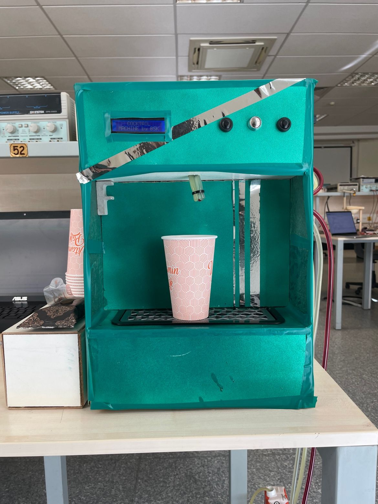
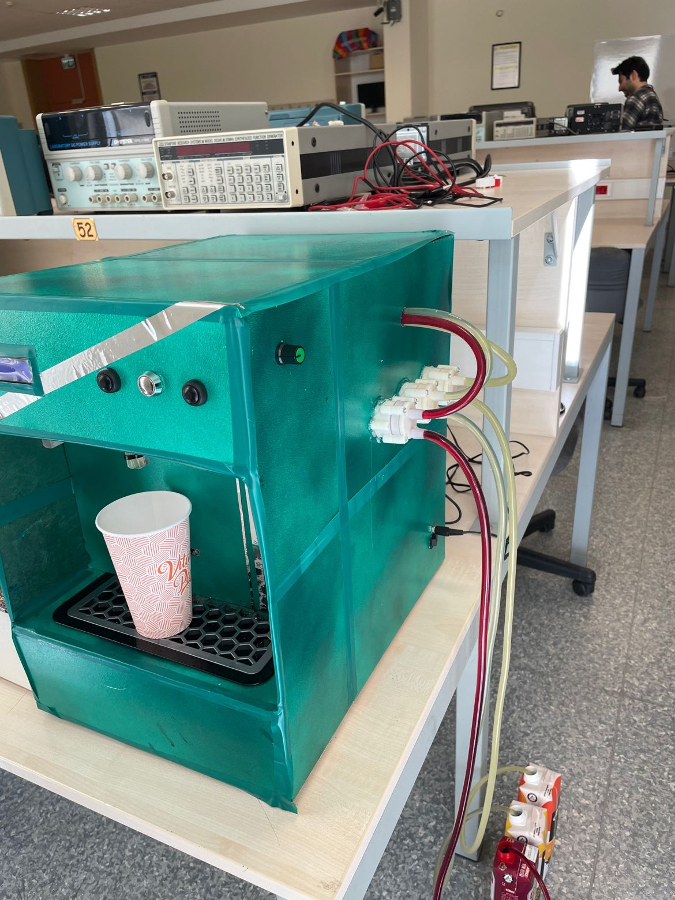

# EEE 102 - Introduction to Digital Circuit Design

[](https://github.com/furkanbsk/EEE102-Digital-Circuit-Design)
[](https://store.digilentinc.com/basys-3-artix-7-fpga-trainer-board-recommended-for-introductory-users/)
[](https://en.wikipedia.org/wiki/VHDL)
[](https://www.xilinx.com/products/design-tools/vivado.html)

> **Course Repository**: Introduction to Digital Circuit Design laboratory work and final project implementation using VHDL on Xilinx BASYS3 FPGA development board.

## 🎯 Course Overview

**EEE 102** introduces fundamental concepts of digital circuit design, FPGA programming, and hardware description languages. This repository contains:

- **7 Laboratory Exercises** covering digital logic fundamentals
- **1 Final Project** implementing an automated cocktail dispensing machine
- **Reference Materials** including BASYS3 documentation and Vivado tutorials
- **Circuit Diagrams** and timing analysis examples

### Learning Objectives

- Understanding digital logic gates and Boolean algebra
- Mastering VHDL hardware description language
- Working with counters, registers, and sequential circuits
- Implementing complex digital systems on FPGA platforms
- Designing user interfaces with LCD displays and push buttons

## 🧪 Laboratory Work

### Lab 1: Digital Logic Fundamentals
- **Topics**: Basic logic gates, truth tables
- **Deliverables**: Logic gate implementations and analysis

### Lab 2: Combinational Circuits
- **Topics**: Combinational logic design
- **Deliverables**: Circuit optimization and implementation

### Lab 3: Counters and Sequential Logic
- **Topics**: 74HC163 counter, clock division
- **Key Components**:
  - Clock signal generation
  - 4-bit synchronous counter implementation
  - Output signal timing analysis
- **Circuit Diagrams**: 74HC163 timing diagrams included

### Lab 4: Advanced Sequential Circuits
- **Topics**: State machines, flip-flops
- **Deliverables**: Sequential circuit design and analysis

### Lab 5: Memory Systems
- **Topics**: RAM, ROM, memory interfacing
- **Deliverables**: Memory system implementations

### Lab 6: VHDL Programming
- **Topics**: Hardware description language fundamentals
- **Reference**: `vhdl_registers_and_counters.pdf`
- **Deliverables**: VHDL code examples and simulations

### Lab 7: FPGA Implementation
- **Topics**: FPGA programming, constraints files
- **Key Components**:
  - Button input handling (active low/high configurations)
  - LED output control circuits
  - Pull-up/pull-down resistor configurations
- **Circuit Diagrams**: Button and LED interface circuits

## 🍹 Final Project: Automated Cocktail Machine

### Project Overview
Design and implementation of an automated cocktail dispensing system using VHDL on BASYS3 FPGA.

### 📸 Completed Project Photos

<div align="center">
  

<br>
<em>Front view of the completed cocktail dispensing machine</em>

<br><br>


<br>
<em>Side view showing the internal pump system and wiring</em>

</div>


### Hardware Components

#### VHDL Modules
- **`Main_Coctail.vhd`** - Primary system controller
- **`LCD_Driver.vhd`** - LCD display interface controller
- **`Text_Display.vhd`** - Text rendering and display management
- **`Pump_Driver.vhd`** - Pump control and timing logic
- **`Cocktail.xdc`** - FPGA pin constraints and timing specifications

#### Features
- 🖥️ **LCD Interface**: Recipe selection and status display
- 🔘 **Button Controls**: User input for cocktail selection
- ⚙️ **Pump Control**: Precise liquid dispensing control
- ⏱️ **Timing System**: Accurate ingredient mixing ratios
- 🔄 **State Machine**: Robust operation flow control

### Technical Specifications

| Component | Specification |
|-----------|---------------|
| FPGA Board | Xilinx BASYS3 (Artix-7) |
| Clock Frequency | 100 MHz (board clock) |
| Display | 16x2 Character LCD |
| Input Method | 5 Push Buttons |
| Output Control | Multiple pump drivers |
| Language | VHDL |
| Development Tool | Xilinx Vivado |

## 🛠 Hardware Requirements

### Essential Components
- **Xilinx BASYS3 FPGA Development Board**
- **16x2 Character LCD Display**
- **Push Buttons** (for user interface)
- **Pumps/Valves** (for liquid dispensing)
- **Connecting Wires** and **Breadboard**
- **Power Supply** (5V for external components)

### Optional Components
- **LEDs** for status indication
- **Resistors** (1kΩ for LED current limiting)
- **Capacitors** for power filtering

## 💻 Software Setup

### Prerequisites
1. **Xilinx Vivado Design Suite** (2018.3 or later)
2. **BASYS3 Board Support Package**


### Installation Steps

1. **Download Vivado**
   ```bash
   # Download from Xilinx website (requires free account)
   # https://www.xilinx.com/products/design-tools/vivado.html
   ```

2. **Install BASYS3 Board Files**
   ```bash
   # Copy board files to Vivado installation directory
   # Location: <Vivado_Install>/data/boards/board_files/
   ```

3. **Clone Repository**
   ```bash
   git clone https://github.com/furkanbsk/EEE102-Digital-Circuit-Design.git
   cd EEE102-Digital-Circuit-Design


## 📞 Contact Information

**Author**: Furkan Büyüksarıkulak    
**Course**: EEE 102 - Introduction to Digital Circuit Design  

